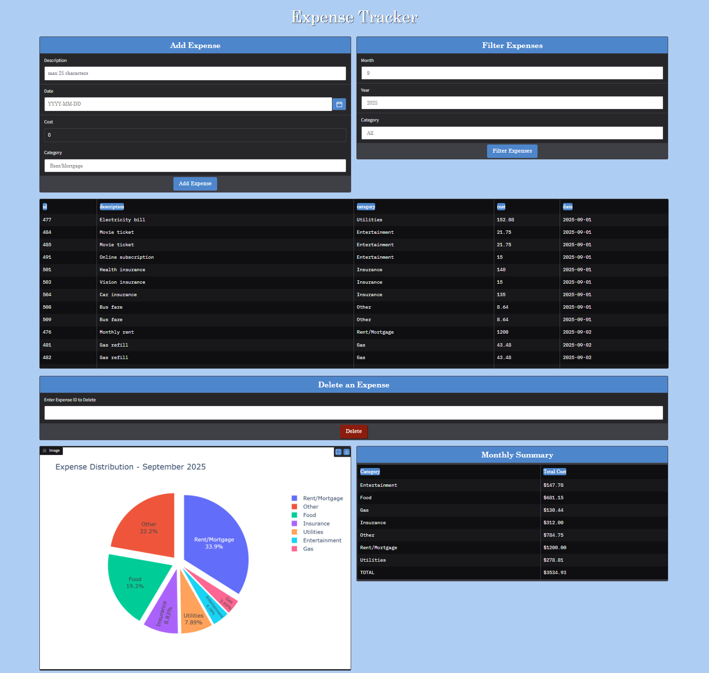
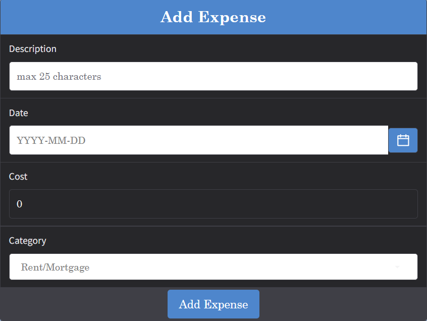
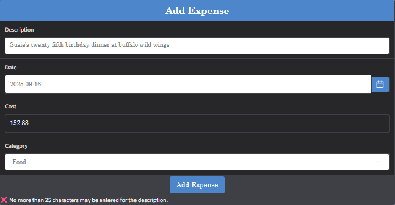
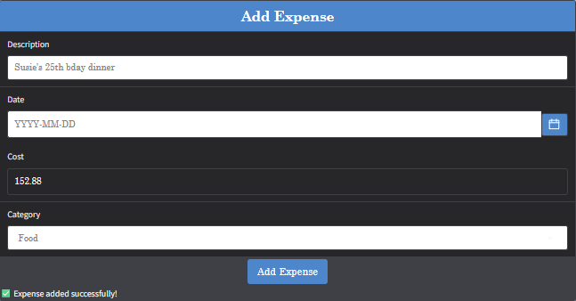
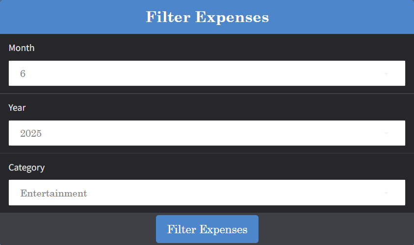
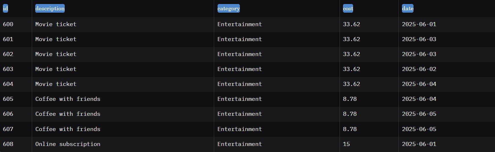
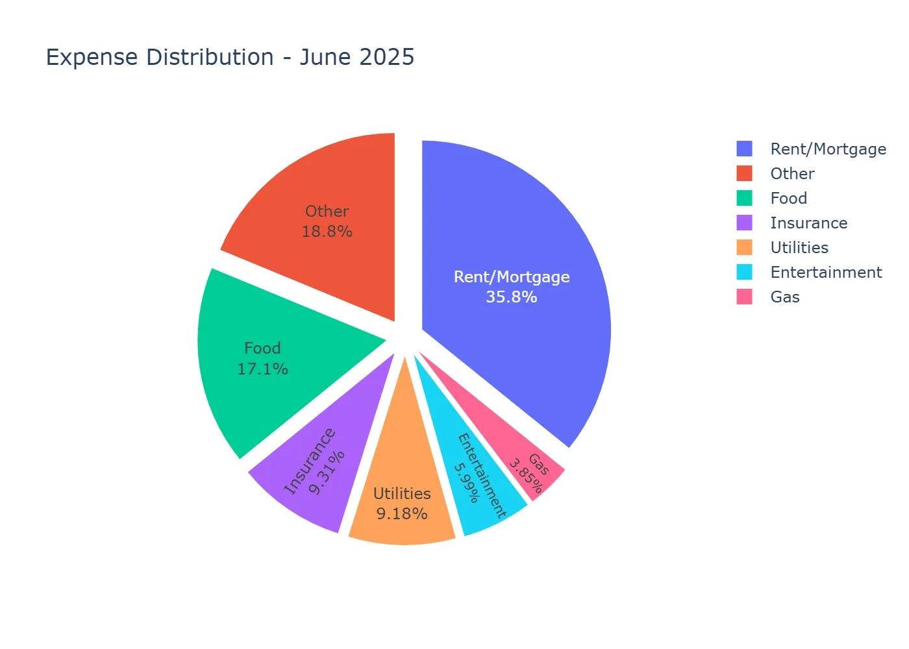
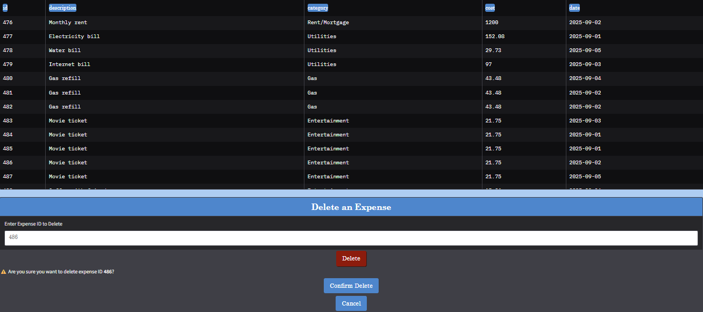
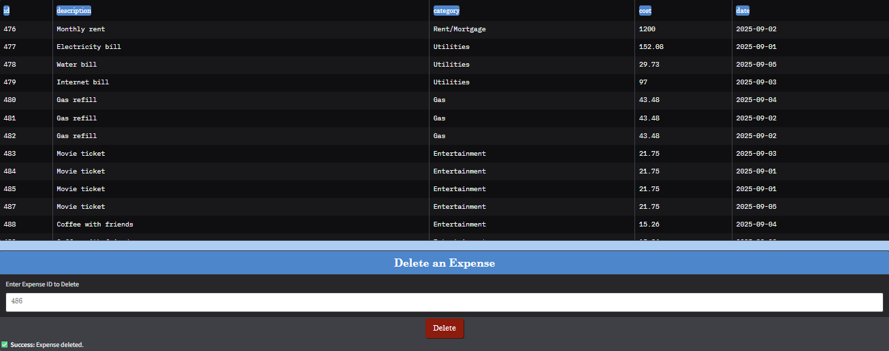

# Expense Tracker

A full-stack web application for managing personal finances. Users can record expenses, analyze spending patterns, and maintain control over monthly budgets through interactive visualizations.

Features -

Expense Management:    Add, view, filter, and delete expenses.
Analytics Dashboard:   Monthly summaries with interactive pie charts (Plotly).
Security First:        Flask API hardened with CSP & security headers.
Testing Coverage:      Functional, performance, and security testing with pytest and OWASP Zap.

Tech Stack -

Frontend:              Gradio
Backend:               Flask
Database:              SQLite
Visualization:         Plotly

Testing -              PyTest, PyTest-Benchmark, OWASP Zap

# Expense Tracker

A full-stack Python application that allows users to input, filter, and delete expenses. The project features a Flask API, a Gradio UI, and a SQLite database for data storage. Visualizations include pie charts and monthly summaries showing how expenses are distributed among categories.

---

## Screenshots / Walkthrough

### 1. Add an Expense
  
*Figure 1: Enter expense details including category, amount, date, and description. All fields are validated before submission.*

---

### 2. Input Error Handling
  
*Figure 2: Validation error displayed when required fields are missing or input is invalid.*

---

### 3. Successful Expense Addition
  
*Figure 3: Confirmation message appears when an expense is successfully added to the database.*

---

### 4. Filtering/Viewing Expenses
  

*Figure 4.1 and 4.2: Filter expenses by date, category, or amount. Results are displayed in a table.*

---

### 5. Pie Chart / Monthly Summary
  
*Figure 5: Visual summary of expenses by category for the month. Chart exported at full resolution using Plotly and Kaleido.*

---

### 6. Deleting an Expense
  
  
*Figure 6.1 and 6.2: Demonstrates deletion of an expense with validation and confirmation.*
